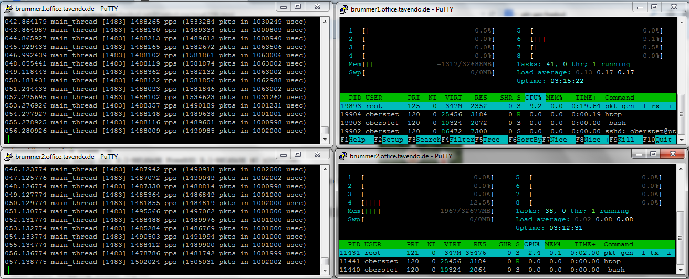
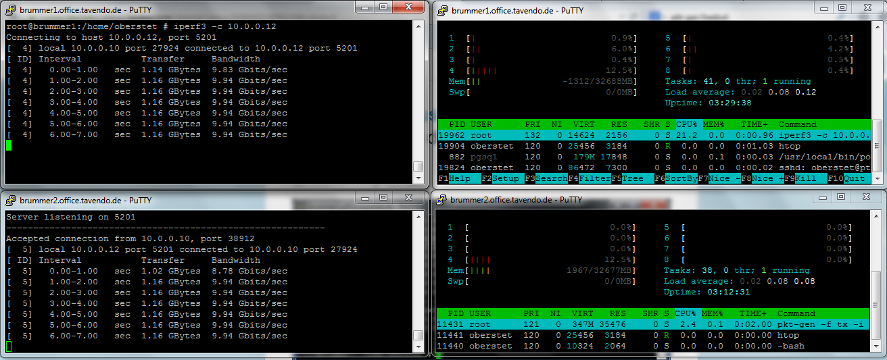
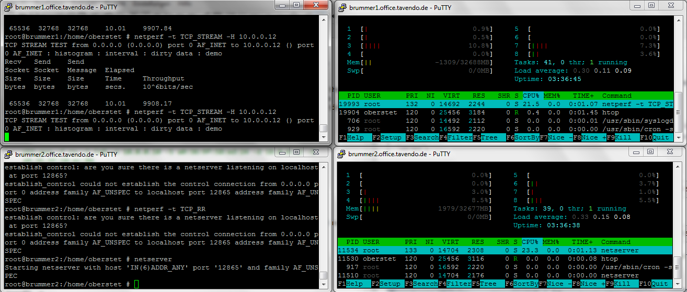
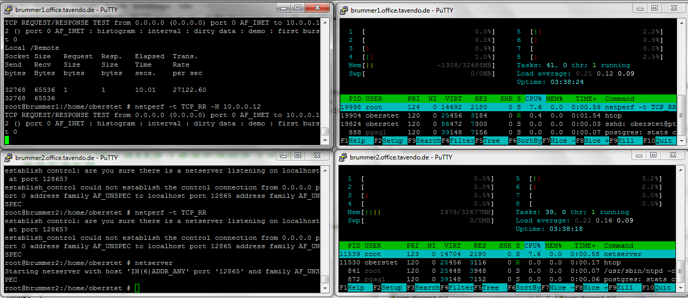

# Pkt-gen

Network performance can also be tested using **pkt-gen**, a tool from the new **netmap** kernel-bypass networking framework.

> Compile a kernel with `device netmap` in the kernel configuration. Compile the "src/tools/tools/netmap" tools during this process. Make sure to copy over the resulting `pkt-gen` (not the "t" !) to a filesystem that allows execution of binaries (which might not be the case for "usr/src").

In a first terminal, run

	pkt-gen -f rx -i ix0 -s 10.0.0.10 -S a0:36:9f:58:ed:24 -d 10.0.0.12 -D a0:36:9f:58:ec:84

And from a second terminal

	pkt-gen -f tx -i ix0 -s 10.0.0.12 -S a0:36:9f:58:ec:84 -d 10.0.0.10 -D a0:36:9f:58:ed:24

> Replace the NICs MAC and IP addresses to be used to match your hardware and network setup.

Here is what that looks like:

# iperf

First terminal:

	iperf3 -s

Then in a second terminal

	iperf3 -c 10.0.0.12

# netperf

In a first terminal:

	netserver -D

in a second terminal:

	netperf -t TCP_RR -H 10.0.0.12

or

	netperf -t TCP_STREAM -H 10.0.0.12

**Bandwidth**

**Requests**

