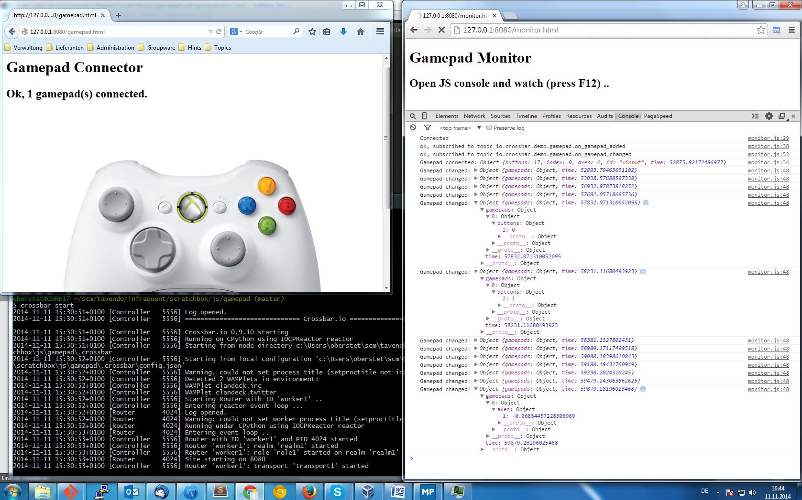

# Using the Gamepad API with WAMP and Crossbar.io</h1>

This demo shows how to use the new [W3C Gamepad API](https://dvcs.w3.org/hg/gamepad/raw-file/default/gamepad.html) to connect your gamepad to the cloud and devices via real-time messaging using 
[WAMP](http://wamp.ws) (which runs over WebSocket) and [Crossbar.io](http://crossbar.io).

This demo works best with Firefox, also Chrome, but no other browser currently (2014/11). To test support and basic operation of your gamepad (without any real-time messaging), you can checkout [this demo](http://luser.github.io/gamepadtest/).

Tested with Microsoft Xbox 360 wireless controller and PC wireless receiver.
See [here](http://support.xbox.com/en-US/xbox-on-other-devices/connections/xbox-360-wireless-gaming-receiver-windows)

## Running

You will need to have [Crossbar.io](http://crossbar.io) installed.

Then, start Crossbar.io (from this directory):

```
crossbar start
```

open [http://localhost:8080](http://localhost:8080) in your browser and follow the instructions.

Here is what the demo looks like when running:


